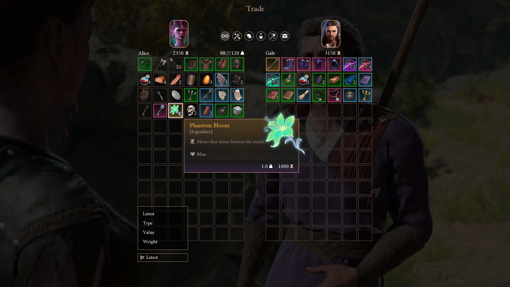

## 🐛 tadpole-dev
A game application example with UX/UI and domain design inspired by Baldur's Gate 3.

### Features
- Domain layer: Core entities and services (Item, Character, Inventory, Trade) covered with unit tests
- Trade UI: Built with MVVM and reactive bindings, featuring item grid panels, item info panel, item drag and drop, item filter and sort panels, item transfer panel, character info panels, tooltip and error panels
- Custom widget-based UI system
- Data save/load system with JSON serialization
- Configuration and asset management
- Result-pattern error handling

### Built with
C++20 | SFML-2.6.2 | RapidJSON-1.1.0 | tl::expected-1.1.0 | magic_enum-0.9.7 | Catch2-2.13.10

### Assets
- Custom UI textures: panels, frames, overlays and coin, weight, sort by icon
- Baldur's Gate 3 textures: Gale portrait (in-game), background and player portrait (from screenshots with edits)
- Item icon textures from Basic RPG Icons and 2000 Fantasy Icons packs by PONETI [(PONETI - Asset Store)](https://assetstore.unity.com/publishers/38930)
- Item category icon textures based on 700+ RPG Icons by Lorc [(700+ RPG Icons | OpenGameArt.org)](https://opengameart.org/content/700-rpg-icons)
- Mignon font
> Note: All third-party assets are used for non-commercial and demonstrative purposes only.

### Preview

### Acknowledgments
I'd like to thank the Baldur's Gate 3 team for their dedication to UX/UI design and overall game experience, which inspired me to create this project.