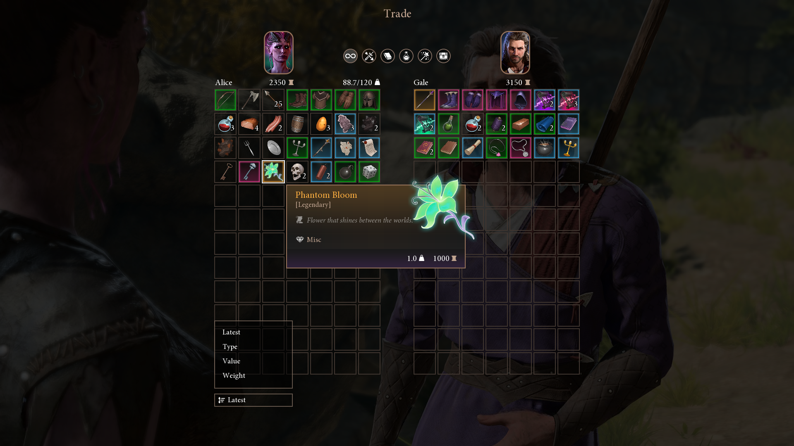

## 🐛 tadpole-dev
A practice and demonstration game app project with UI/UX and domain design inspired by Baldur's Gate 3.

### Features
- Domain layer: Core entities and services (Item, Character, Inventory, Trade) covered by unit tests
- Trade UI: Built with MVVM and Rx bindings, featuring:
    - Item grid panels
    - Item info panel
    - Item drag & drop
    - Item filter and sort panels
    - Item transfer panel
    - Character info panels
    - Tooltip panel
    - Error panel
- Custom widget-based UI system
- Data save/load system with JSON serialization
- Config and asset management systems
- Result-style error handling

### Built with
C++20 | SFML-2.6.2 | RapidJSON-1.1.0 | tl::expected-1.1.0 | magic_enum-0.9.7 | Catch2-2.13.10

### Assets
- Custom UI textures: panels, frames, overlays and icons (coin, weight, sort by)
- Baldur's Gate 3 textures: Gale portrait by Edward Vanderghote [(ArtStation)](https://www.artstation.com/artwork/9EOdoW), background and player portrait (from screenshots with edits)
- Item icon textures from Basic RPG Icons and 2000 Fantasy Icons packs by PONETI [(PONETI - Asset Store)](https://assetstore.unity.com/publishers/38930)
- Item category icon textures based on 700+ RPG Icons by Lorc [(700+ RPG Icons | OpenGameArt.org)](https://opengameart.org/content/700-rpg-icons)
- Mignon font

### Preview

[YouTube Demo](https://youtu.be/-nKfSHa5eXc)

### Acknowledgments
I want to thank the Baldur's Gate 3 team for their dedication to UI/UX design and overall game experience, which inspired this project.